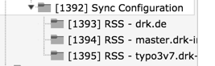
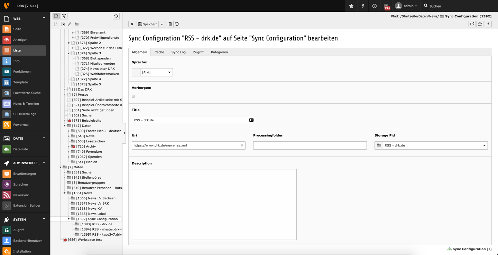
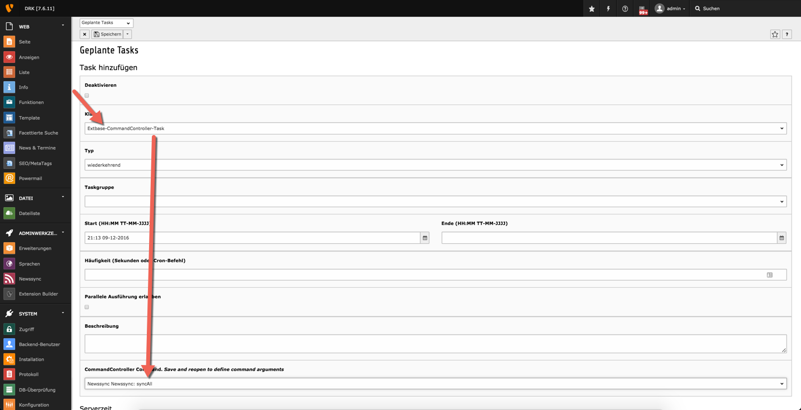
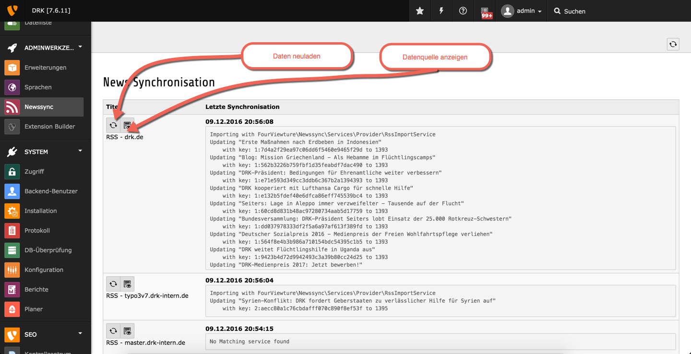

# Newssync Erweiterung

Diese Erweiterung stellt die Möglichkeit der Synchronisation von News zwischen mehreren TYPO3-Installationen zur Verfügung.

Dazu kann diese Erweiterung sowohl als Empfänger und auch Bereitsteller von Daten agieren.

Vorraussetzungen:

* laufendes TYPO3 v7.6+
* Extension news

# Einrichtung

* Installieren wie jede Extension
* Sysfolder für die SyncConfigs und Daten anlegen
* SyncConfigs anlegen
* Scheduler Task anlegen

## Installation

## Sysfolder für die SyncConfigs und Daten anlegen

## SyncConfig anlegen

## Scheduler Task anlegen

# Backend Module

